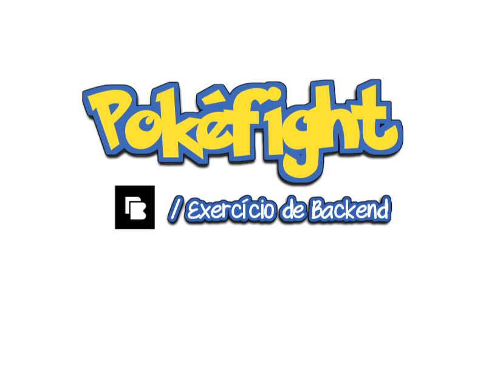

# Exercício de Backend

## Introdução

A proposta do exercício de backend da Brainn é ser simples e divertido, com temática lúdica de Pokémon.

## Exercício

O objetivo do exercício é a construção de uma **API Web** que implementa geração de batalhas entre pokémons.

### Recursos

- [PokéAPI](https://pokeapi.co/)

### Requisitos e funcionalidades

A API desenvolvida deve possuir 3 rotas:

- Criar uma batalha de pokémon (create)
- Consultar o resultado de uma batalha (show)
- Listar os resultados de todas as batalhas (index)

Para isso, a aplicação deve fazer consultas de informações de pokémons à [PokéAPI](https://pokeapi.co/) e gerar batalhas entre os pokémons solicitados. As batalhas geradas devem ser persistidas num banco de dados de forma que possam ser consultadas posteriormente.

É esperado que sejam retornadas informações dos pokémons envolvidos e quem foi o vitorioso nas batalhas. Dica: o pokémon vitorioso pode ser decidido randomicamente.

**Propostas para a rota de criação:**

- Síncrona:
  - Realizar as chamadas à PokéAPI no mesmo momento em que são realizadas as chamadas às rotas da API a ser desenvolvida.
- Assíncrona
  - Criar jobs para realizar as requisições assincronamente na PokéAPI.
  - Devolver o resultado via webhook

### Tecnologias sugeridas

- Elixir / Node.js
- Banco de dados apropriado

## Dúvidas

Se você possui alguma dúvida sobre o desafio, você pode entrar em contato por e-mail com o recrutamento que já estará acompanhando seu processo ou através do e-mail mariana@brainn.co.

## Caso tenha finalizado e...

#### → Já está participando do processo

Basta sinalizar por e-mail que finalizou o exercício para darmos continuidade ao processo.

#### → Ainda não está participando do processo

Basta enviar o link do seu teste para mariana@brainn.co para quem sabe chamarmos você para um bate-papo :blush: :v:
